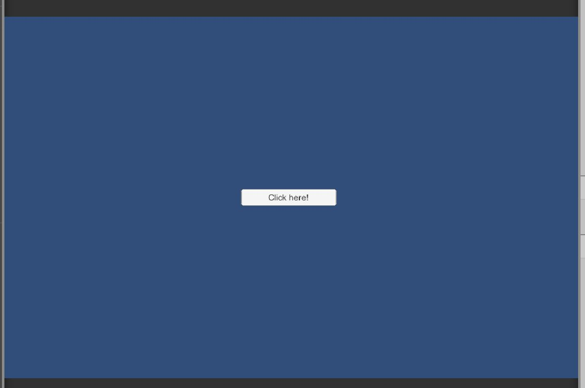

# conditions pklacher

### Project description: 
Project to improve skills on conditions.
### Development platform: 
Winwows 10, Unity Version 2020.1.5f1, Visual Studio 2019

### Target platform: 
WebGL, reference resolution 600x960

### Visuals: 

### Necessary setup/execution steps: 
none

### Third party material: 
none

### Project state: 
Finished

### Limitations: 

### Lessons Learned: 
<ul>
  <li> Check if 4 numbers are grater than 5</li>
  <li> Check if key is pressed for a specific time </li>
  <li> Check if specific keys are pressed </li>
  <li> Check if GameObject is active </li>
</ul>  

Copyright by Pia Lacher
